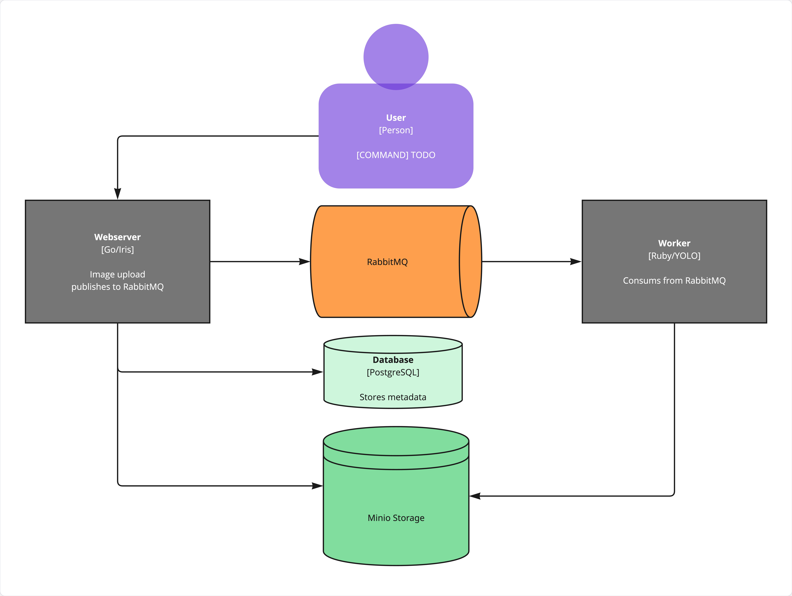

# Irmgard Cloud Computing

Kubernetes infrastructure for an image processing pipeline: manually
configured RabbitMQ cluster with quorum queues, highly available
PostgreSQL via the Zalando operator, MinIO object storage, and a
Fluentd/OpenSearch logging stack. Focus on redundancy, failover
behavior, and horizontal scaling, deployed and tested on Minikube.

## Architecture



The webserver accepts image uploads, stores the file in MinIO, writes
metadata to PostgreSQL, and publishes a job message to RabbitMQ. The
worker consumes that message, retrieves the image from MinIO, runs
YOLO-based object detection, and stores the processed result back in
MinIO.

## Components

| Component | Setup | Replicas | Notes |
|---|---|---|---|
| Webserver | Deployment | >= 1 | Go/Iris, image upload, publishes to RabbitMQ |
| Worker | Deployment | >= 1 | Ruby, YOLO object detection, consumes from RabbitMQ |
| RabbitMQ | StatefulSet (manual) | 3 | Quorum queues, peer discovery via k8s API |
| PostgreSQL | Zalando Postgres Operator | 3 | Streaming replication, automatic failover (Patroni) |
| MinIO | Deployment | 1 | S3-compatible object storage |
| Fluentd | DaemonSet | 1/node | Collects container logs |
| OpenSearch | Helm chart | 1 | Log storage and search |

## Attribution

The webserver (Go) and worker (Ruby) are based on template code and
assignment instructions provided as part of the "Cloud Computing"
course at HTW. The original assignment READMEs are kept for reference
at `src/webserver/ORIGINAL-ASSIGNMENT.md` and
`src/worker/ORIGINAL-ASSIGNMENT.md`.

My own contributions cover completing the TODOs in both codebases
and building the entire Kubernetes infrastructure described below.

- Completing the TODOs in both codebases (env-var configuration,
  bucket handling, queue declaration with quorum type, error handling,
  least-privilege user setup)
- The entire Kubernetes infrastructure (see `k8s/`): a hand-built
  RabbitMQ cluster (no operator, manual peer discovery/RBAC/health
  checks), HA PostgreSQL via the Zalando operator, MinIO, and a
  Fluentd + OpenSearch logging stack
- All debugging, redundancy testing, and failover analysis documented
  in `docs/report.md`

## Prerequisites

- Minikube (or another Kubernetes cluster)
- Helm (for the Zalando Postgres Operator and OpenSearch)
- `kubectl` configured against the target cluster

This setup assumes the namespace **`k8s-training`**. If you deploy into
a different namespace, update the hardcoded references in:
- `k8s/logging/fluentd-daemonset.yaml` (ClusterRoleBinding subject namespace)
- `k8s/rabbitmq/rabbitMQ.yaml` (`cluster_formation.k8s.hostname_suffix`)

## Deployment order

```bash
# 0. Install operators/charts (one-time, cluster-wide)
helm repo add postgres-operator-charts https://opensource.zalando.com/postgres-operator/charts/postgres-operator
helm install postgres-operator postgres-operator-charts/postgres-operator --namespace k8s-training

helm repo add opensearch https://opensearch-project.github.io/helm-charts/
helm install opensearch opensearch/opensearch --namespace k8s-training \
  --set singleNode=true \
  --set "extraEnvs[0].name=OPENSEARCH_INITIAL_ADMIN_PASSWORD" \
  --set "extraEnvs[0].value=<your-password>"
helm install opensearch-dashboards opensearch/opensearch-dashboards --namespace k8s-training \
  --set opensearchHosts="https://opensearch-cluster-master:9200"

# 1. Shared config & secrets
kubectl apply -f k8s/shared/

# 2. Backend services
kubectl apply -f k8s/rabbitmq/rabbitMQ.yaml
kubectl apply -f k8s/postgres/postgres-cluster.yaml
kubectl apply -f k8s/minio/minioOS.yaml

# wait until all pods are Running/Ready
kubectl get pods -w

# 3. Database migration (creates schema, grants least-privilege access)
kubectl apply -f k8s/job/migration-job.yaml
kubectl logs -l job-name=irmgard-db-migration

# 4. Application
kubectl apply -f k8s/webserver/irmgard.yaml
kubectl apply -f k8s/worker/worker.yaml

# 5. Logging (optional)
kubectl apply -f k8s/logging/fluentd-config.yaml
kubectl apply -f k8s/logging/fluentd-daemonset.yaml
```

**Note:** `k8s/shared/secret-htw.yaml` is not included in this repo.
Copy `secret-htw.example.yaml`, fill in your own credentials, and apply
it before anything else.

**Note:** `migration-job.yaml` creates a Kubernetes `Job`, which is
mostly immutable once created. If you need to re-run it (e.g. after a
full reset), delete the old job first:
```bash
kubectl delete job irmgard-db-migration --ignore-not-found
kubectl apply -f k8s/job/migration-job.yaml
```

## Notable troubleshooting / things learned

- **RabbitMQ cluster bootstrap race conditions**: starting all 3 nodes
  simultaneously occasionally produced `inconsistent_cluster` errors
  during Mnesia schema merge — a known timing issue with manual peer
  discovery, resolved by restarting the affected pod(s).
  
- **Quorum queue majority behavior**: verified experimentally that a
  3-member quorum queue tolerates exactly 1 node failure; losing 2 of 3
  makes the queue unavailable (no data loss, but blocked) until a
  majority is restored — a direct illustration of the CAP theorem
  trade-off.
  
- **`kubectl port-forward` is not a load balancer**: it binds to a
  single pod for the lifetime of the forwarded connection, which
  initially made horizontal scaling of the webserver look ineffective.
  Verified real load-balancing behavior using an in-cluster client
  hitting the Service DNS name directly.
  
- **Image registry churn**: `minio/minio` and later `quay.io/minio/minio`
  became unavailable/unauthorized mid-project; had to migrate to
  `bitnami/minio`, then `bitnamilegacy/minio` as Bitnami restructured
  its Docker Hub namespace — a practical case for pinning specific,
  verified tags instead of `:latest` in reproducible setups.
  
- **Postgres least-privilege setup**: separated the Zalando-operator
  superuser (schema migration only) from the application's runtime
  user (`SELECT`/`INSERT`/`UPDATE` only), rather than giving the app
  owner-level rights.

## License

Course project — see attribution above regarding template code origin.
